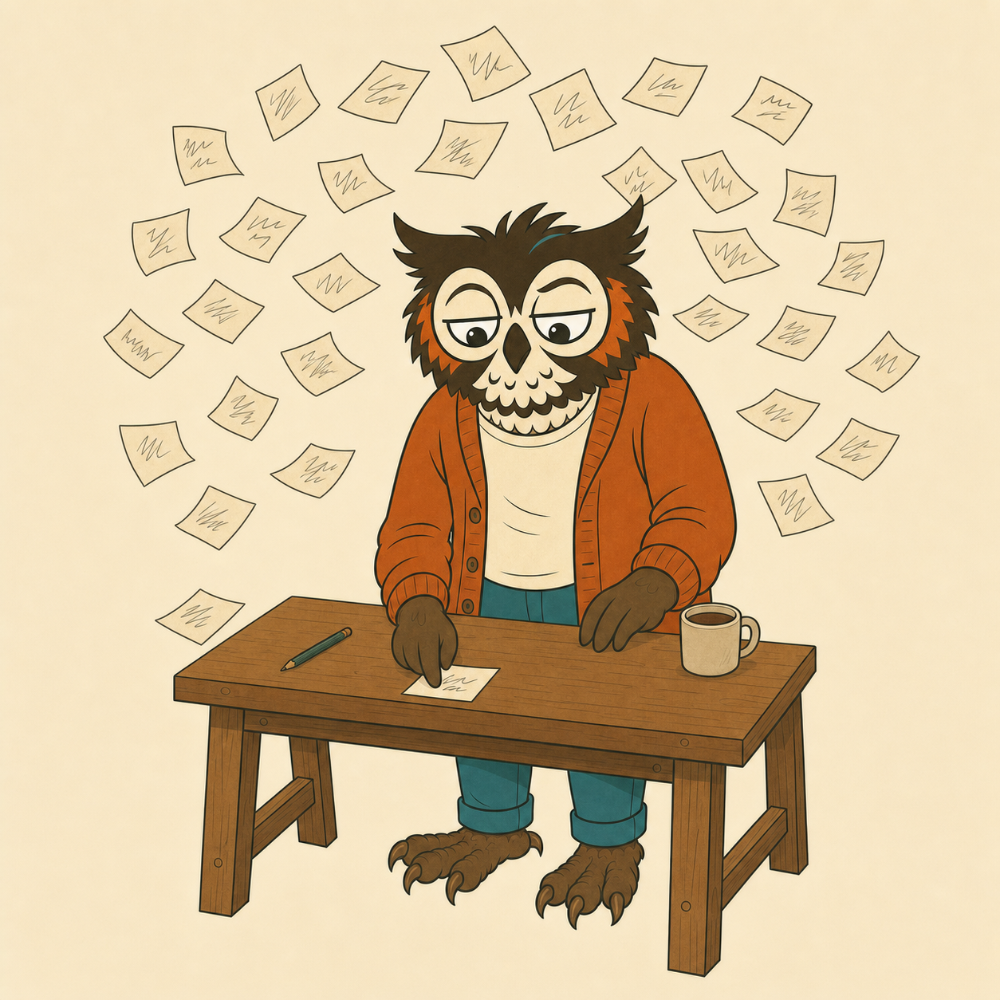

<p align="center">
  
</p>

# scatterbrain

Give your [Zo Computer](https://zo.computer) a deliberate case of ADHD.

Scatterbrain is an open-source Zo skill that splits an open-ended question across five isolated parallel child sessions, each thinking under a deliberately distorted cognitive frame, then runs a separate critic session that scores every idea and flags the ones that look good but are traps. MIT licensed, with a hosted overview at [the-little-ai-company.github.io/scatterbrain](https://the-little-ai-company.github.io/scatterbrain/).

The first three answers to any open question are the answers a competent person gives in thirty seconds. Correct, safe, forgettable. The ideas worth paying for live past number three, and a single line of thinking never reaches them because it anchors on whatever it said first. Ask a model to "brainstorm 20 ideas" and you get one idea wearing 20 hats, because every idea in the list can see the ideas above it.

Scatterbrain fixes the architecture instead of the prompt. It splits the problem across several child Zo sessions that run in parallel and never see each other. No shared context, no anchoring. Each branch thinks under a deliberately distorted cognitive frame: a night dispatcher, a salvage mechanic, a paid saboteur, a mycologist. Then a separate critic session, running with the opposite instructions, scores everything, clusters it by angle, flags the ideas that look good but are traps, and deepens the few worth building.

Scatter, then hyperfocus. The two phases never mix.

## What a run looks like

```
[scatterbrain] run plan: 5 frames x 6 ideas, 3 deepened -> about 10 child sessions
[scatterbrain] reframe: stripping incidental anchors
[scatterbrain] scatter: 5 frames -> saboteur, street-vendor, mycologist, coroner, lockpicker
[scatterbrain] hyperfocus: critic scoring 28 ideas
[scatterbrain] hyperfocus: deepening top 3
```

You get back a wide set grouped by angle with scores on each idea, a shortlist with one starred sleeper pick, a trap list with a one-line reason per trap, and a worked sketch of the top survivors (how it works, the load-bearing risk, the first concrete step).

The scoring axes are spark (distance from the obvious default), legs (could it actually run), and aim (does it hit the stated problem). Legs is weighted heaviest, at 0.40, because a brilliant unshippable idea is a trap with good lighting.

## Install

On your Zo Computer:

```bash
git clone https://github.com/The-Little-AI-Company/scatterbrain.git /home/workspace/Skills/scatterbrain
```

That's it. Zo picks up skills from the `Skills/` folder. Say "scatterbrain this" in any conversation, or run the engine directly:

```bash
bun /home/workspace/Skills/scatterbrain/scripts/scatterbrain.ts \
  "how should I price a tool nobody has a budget line for yet" \
  --mode open
```

The engine is a single zero-dependency Bun script. It talks to Zo's `/zo/ask` API, which is why it needs to run on a Zo Computer (it reads `ZO_CLIENT_IDENTITY_TOKEN` from the environment). On any other agent platform the `SKILL.md` still works as a degraded inline protocol, with the honest caveat that inline branches are not truly isolated.

## Flags

```
--frames N         cognitive frames to scatter across (default 5, max 8)
--ideas N          ideas per frame (default 6, max 10)
--top N            survivors that get deepened (default 3, max 4)
--mode build|open  frame bias: build for code-shaped work, open for product/content/life
--context "..."    constraints passed to every branch
--model ID         model for every child call
--no-reframe       skip the anchor-stripping pass
--dry-run          stub every call; test the plumbing for free
--text / --json    force human render / force JSON (auto-detects a terminal)
```

## Cost, stated plainly

A default run is about 10 child Zo sessions: 5 scatter branches, 1 reframe, 1 critic, 3 deepen calls. That is real money and one to three minutes of wall clock, which is why the skill ships with a gate: it refuses to fire on questions with one right answer, closed phrasing ("quick", "standard", "just"), or low stakes. Scale it down with `--frames 3 --ideas 4 --top 2` when the question is small.

## The frames

Fourteen ship in the catalog. A frame is not a persona for flavor; it is a forcing function with its own physics. The night dispatcher thinks in loads that must move tonight. The casino pit boss thinks in house edge and whales. The assumption thief steals the one thing everyone treats as fixed and asks what becomes possible without it.

The catalog, plus a three-test guide for writing your own frames, lives in [`references/frames.md`](references/frames.md). The short version: a good frame has physics, bans the default answer, and generalizes across problem types. "Pirate" is a costume. "Night dispatcher" is a frame.

## Lineage

Scatterbrain is a ground-up Zo rebuild of the divergent ideation loop in [ADHD by Udit Akhouri](https://github.com/UditAkhourii/adhd) (MIT). Same core insight, different isolation primitive (Zo child sessions instead of Claude Code task calls), new engine, new frames, new prose. Credit where it is due; go star the original.

Built by [The Little AI Company](https://littleaicompany.com). The owl is Hollis. He remains faintly unconvinced.

## License

MIT. See [LICENSE](LICENSE).
